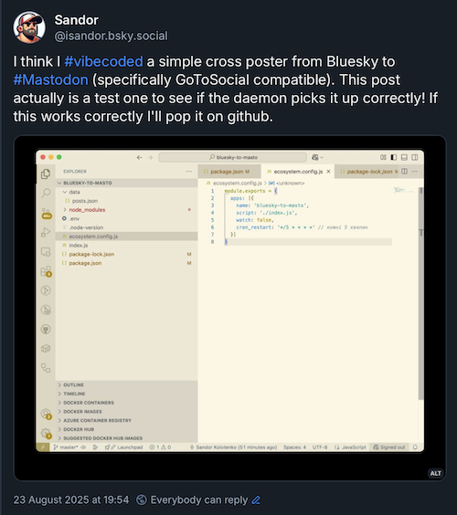
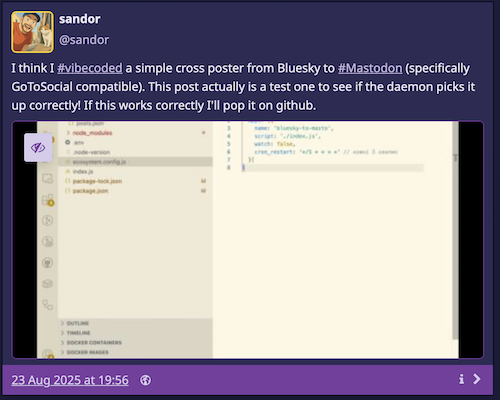

# Bluesky to Mastodon Sync

Автоматично переносить ваші пости з [Bluesky](https://bsky.app/) до [Mastodon](https://joinmastodon.org/), виключаючи відповіді та відео. [Для інструкцій солов'їною натискай сюди.](#-інструкція-українською)

Automatically syncs your posts from [Bluesky](https://bsky.app/) to [Mastodon](https://joinmastodon.org/), skipping replies and video posts.




## 🌍 English Instructions

### Requirements

* Node.js `v20.19.0` (see `.node-version`)
* Accounts on Bluesky and Mastodon
* Mastodon API token

### Setup

1. Clone the repository:

```bash
git clone https://github.com/SandorUK/Bluesky-to-Masto.git
cd Bluesky-to-Masto
```

2. Install dependencies:

```bash
npm install
```

3. Create a `.env` file with the following content:

```
BLUESKY_HANDLE=your_nickname.bsky.social
BLUESKY_PASSWORD=app_specific_password
MASTODON_URL=https://mastodon.social
MASTODON_TOKEN=token
SINCE_DATE=2025-08-22T00:00:00Z
```

`SINCE_DATE` date to sync the posts after from Bluesky to Mastodon.

> ⚠️ **If you have more than 50 posts since this date, the app will sync only first fifty posts.**

> ⛑️ **Use an app-specific password** for Bluesky, not your main password.

4. Run the script:

```bash
node index.js
```

5. Run as a background daemon:

```bash
npm run daemon
```

Or:

```bash
pm2 start index.js --name bluesky2mastodon
```

### 📆 How to generate a Mastodon API token (GoToSocial):

GoToSocial does not directly provide a token — you need to follow two steps:
1. Create an application,
2. Exchange it for a token using `curl`.

1. Create an application:
    1. Log in to your GoToSocial web interface (e.g. https://mastodon.yourdomain.tld/settings/applications).
    2. Click **“New Application”**.
    3. Set any name, for example: **Bluesky Sync**.
    4. Enable the following scopes/permissions:
        • write:media  
        • write:statuses  
    5. In the **Redirect URI** field, enter:
       `urn:ietf:wg:oauth:2.0:oob`  
       (This is a workaround for desktop/local scripts.)
    6. Create the application.
    7. Copy the **Client ID** and **Client Secret**.

2. Exchange credentials for a token with `curl`:

```bash
curl -X POST https://your.gotosocial.domain/api/v1/oauth/token \
  -d "grant_type=password" \
  -d "client_id=YOUR_CLIENT_ID" \
  -d "client_secret=YOUR_CLIENT_SECRET" \
  -d "username=YOUR_USERNAME" \
  -d "password=YOUR_PASSWORD" \
  -d "scope=write:media write:statuses"
```

✅ The response will contain a JSON with an `access_token`, e.g.:

```json
{
  "access_token": "abc123exampletokentext..."
}
```

🔐 Paste this `access_token` into your `.env` file:

```
MASTODON_TOKEN=abc123exampletokentext...
```

## 🇺🇦 Інструкція українською

### Вимоги

* Node.js `v20.19.0` (див. `.node-version`)
* Облікові записи у Bluesky та Mastodon
* Токен для Mastodon API

### Налаштування

1. Клонуй репозиторій:

```bash
git clone https://github.com/SandorUK/Bluesky-to-Masto.git
cd Bluesky-to-Masto
```

2. Встанови залежності:

```bash
npm install
```

3. Створи `.env` файл зі слідуючим:

```
BLUESKY_HANDLE=ваш_нікнейм.bsky.social
BLUESKY_PASSWORD=пароль_додатку
MASTODON_URL=https://mastodon.social
MASTODON_TOKEN=токен
SINCE_DATE=2025-08-22T00:00:00Z
```

`SINCE_DATE` дата починаючи з якої дописи сінхронізуються.

> ⚠️ **Якщо ви маєте більше ніж 50 дописів з цієї дати лише перші 50 буде сінхронізовано.**

> ⛑️ **Використовуй саме пароль додатку (app password)** для Bluesky, а не основний.

4. Запусти:

```bash
node index.js
```

5. Запустити як демон сервіс:

```bash
npm run daemon
```

Або
```bash
pm2 start index.js --name bluesky2mastodon
```

### 📆 Як створити Mastodon API токен (GoToSocial):

GoToSocial не надає токен напряму — треба пройти два кроки:
1. Створити застосунок,
2. Отримати токен за допомогою curl.

1. Створіть застосунок:
	1.	Увійдіть у свій GoToSocial інтерфейс (https://mastodon.yourdomain.tld/settings/applications).
	2.	Натисніть “New Application”.
	3.	Задайте довільну назву, наприклад Bluesky Sync.
	4.	Увімкніть такі scopes/права доступу:
	•	write:media
	•	write:statuses
	5.	У полі Redirect URI введіть:
`urn:ietf:wg:oauth:2.0:oob`
(це обхідний варіант для десктопних скриптів)
	6.	Створіть застосунок.
	7.	Скопіюйте Client ID та Client Secret.

2. Отримайте токен за допомогою curl

Запустіть у терміналі:
```
curl -X POST https://your.gotosocial.domain/api/v1/oauth/token \
  -d "grant_type=password" \
  -d "client_id=ВАШ_CLIENT_ID" \
  -d "client_secret=ВАШ_CLIENT_SECRET" \
  -d "username=ВАШ_ЛОГІН" \
  -d "password=ВАШ_ПАРОЛЬ" \
  -d "scope=write:media write:statuses"
  ```
✅ У відповідь ви отримаєте JSON з полем access_token, наприклад:

```
{
  "access_token": "abc123exampletokentext...",
  ...
}
```

🔐 Вставте цей access_token у .env файл:

```
MASTODON_TOKEN=abc123exampletokentext...
```